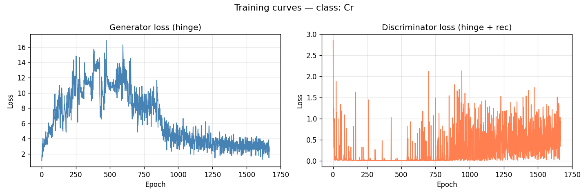
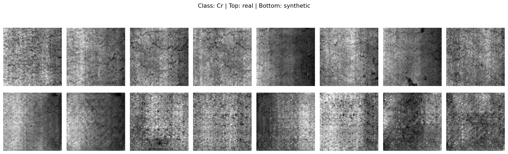

# FastGAN with DiffAugment on NEU Surface Defect Dataset

## Overview
This repository presents an implementation of **FastGAN** incorporating **Differentiable Augmentation (DiffAugment)** to generate realistic industrial surface defects, specifically focusing on the **NEU Surface Defect Dataset** (Crazing class `Cr`).

Industrial defect datasets are often constrained by the limited number of samples available. By leveraging FastGAN—a lightweight generative adversarial network optimized for few-shot learning—alongside DiffAugment to stabilize training and prevent discriminator overfitting, we are able to produce high-quality defect images efficiently.

## What We Have Done
- **Dataset Preparation**: Processed the NEU Surface Defect dataset, extracting and normalizing the `Cr` (Crazing) defect class for few-shot training.
- **Model Architecture (FastGAN)**: 
  - Designed a lightweight Generator utilizing Skip-Layer Excitations (SLE) for better gradient flow and robust structural generation.
  - Implemented a PatchGAN-style Discriminator tailored for high-fidelity texture and localized defect detection.
- **Differentiable Augmentation (DiffAugment)**: Applied real-time augmentations (such as translation, cutout, and color adjustments) during the training loop on both real and generated images. This significantly improved the convergence and stability of the model.
- **Evaluation**: Integrated Fréchet Inception Distance (FID) scoring as a robust metric to validate the distribution similarity between the real and synthesized defects.

## Results
The trained FastGAN model successfully learned the intricate patterns and textures associated with the `Cr` defect class.

### Quantitative Metrics
- **FID Score**: **75.3** (Demonstrating strong visual fidelity and statistical similarity to the real industrial distribution).

### Visualizing the Results

#### 1. Training Loss Curve
The generator and discriminator losses over the training epochs indicate stable adversarial training dynamics without mode collapse.

#### 2. Real vs. Generated Comparison
A side-by-side visual comparison showcases the model's ability to replicate the complex morphological features of crazing defects.

## Model Weights
- *The pre-trained model weights (`fast_gan.pt`) exceed GitHub's standard file size limits and are available upon request or hosted on an external platform.*

## Structure
- `fastgan_diffaug_neu.ipynb`: The main notebook containing the full training pipeline, augmentation logic, and evaluation steps.
